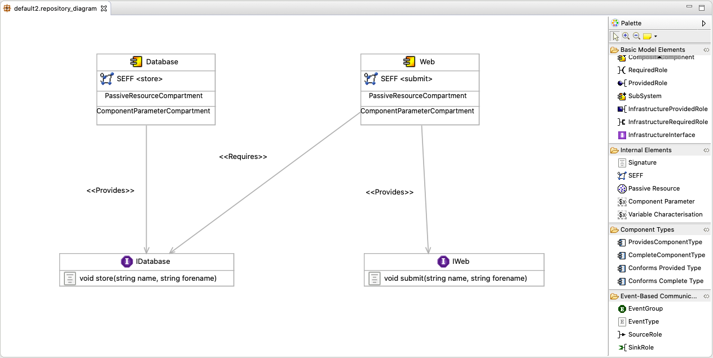
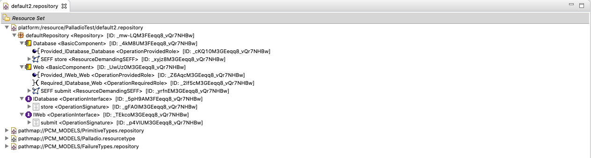

# PalladioFluentAPI

Hi Philip,

die fluent API läuft komplett über die FluentAPIFactory. Die musst du einmal initialisieren und kannst dann damit Repository, Components oder eben SEFFs erstellen.
```java
FluentRepositoryFactory create = new FluentRepositoryFactory();
		
Repository repo = create.newRepository()
				.addToRepository(create.newOperationInterface().withName("IDatabase")
									.withOperationSignature()
										.withName("saveDatabaseEntry").now())
				.addToRepository(create.newBasicComponent().withName("Database")
									.withServiceEffectSpecification(create.newSeff()
											.onSignature(create.fetchOfSignature("saveDatabaseEntry"))
											.withSeffBehaviour().withStartAction()
												.followedBy().externalCallAction()
												// beliebig viele Actions
												.followedBy().stopAction().createBehaviourNow()))
				.createRepositoryNow();
```

Oder wenn du wirklich nur den SEFF willst:

```java
ServiceEffectSpecification seff = create.newSeff()
		.withSeffBehaviour().withStartAction()
			.followedBy().externalCallAction()
			// beliebig viele Actions
			.followedBy().stopAction().createBehaviourNow().build();
```

Ich hoffe, das hilft dir erst mal weiter. Wenn du Fehler findest oder Verbesserungsvorschläge hast, immer her damit.

Viele Grüße
Louisa

## Project Description
This project provides a fluent API to create a PCM Repository Model.

### Palladio Component Model (PCM)
Palladio is a software architecture simulation approach which analyses your software at the model level for performance bottlenecks, scalability issues, reliability threats, and allows for a subsequent optimisation.
The Palladio Component Model (PCM) is one of the core assets of the Palladio approach. It is designed to enable early performance, reliability, maintainability, and cost predictions for software architectures and is aligned with a component-based software development process. The PCM is implemented using the Eclipse Modeling Framework (EMF). Visit the [Homepage](https://www.palladio-simulator.com) for more information.

#### PCM Repository Model
The PCM is realized as an Eclipse Plugin. Creating PCM repository model is fairly simple using the diagram editor. The image below shows the graphical diagram editor with a simple repository model. The palette on the right provides the user with all the model elements. Selecting an element and clicking onto the model plane creates the basic model elements. Additionally, most elements can be further edited using the ```Properties``` view.

The tree view of the repository model editor shows the model elements in their structure. New model elements, i.e. children of the tree branches, can be created by right clicking on a tree node. The editor shows the selection that is sensible at this point in the model structure. Furthermore, the tree view shows the 3 repositories that are imported by default: primitive types, failure types and a resource repository. Their elements can be used freely.


#### Fluent Interfaces
A fluent interface, also called fluent API, is a certain style of interface which is especially useful for creating and manipulating objects. The goal of a fluent interface is to increase code legibility by creating a domain-specific language (DSL). Its design relies on method chaining to implement method cascading. Thus, each method usually returns this, i.e. the manipulated object itself. Prominent examples of fluent interfaces are the [Java Stream API](https://docs.oracle.com/javase/8/docs/api/java/util/stream/package-summary.html) and [JMock](http://jmock.org).

## Motivation
- das in code zu implementieren ist halt kacke mit den 20 verschiedenen factories. -> code Beispiel; Und der Aufbau soll möglichst simple sein, um anwendern ohne großes vorwissen genau diese Methoden auszuspucken, die halt hier sinnvoll sind. 

## Example
Ein Beispiel -> verlinke auf Beispiel Code im Repo

## Aufbau der API
wie ist die API aufgebaut

## Recherche und Entwicklung
für den Nutzer unwichtig, aber als Praktikumsbericht sinnvoll: was hab ich mir wobei gedacht.

## Project Setup

For using the fluent API, three dependencies are required:
1. Palladio-Core-PCM (org.palladiosimulator.pcm)
2. Palladio-Core-PCM Resources (org.palladiosimulator.pcm.resources)
3. Palladio FluentAPI (org.palladiosimulator.fluentapi)

It is recommended to work with a PCM installation. Therefor, install the PCM Nightly as described at [PCM_Installation#PCM_Nightly](https://sdqweb.ipd.kit.edu/wiki/PCM_Installation#PCM_Nightly).
Create your own Plug-in Project and add the three dependencies in the MANIFEST.MF file.
You are now ready to use the `FluentRepositoryFactory` to create a Repository.


## Recherche
* EMF
* Eclipse Plugin
* Fluent Interfaces
* Palladio
* diverse Tutorials, YouTube Videos, Wiki Seiten, andere Internet-Ressourcen

### Praktische Recherche
* EMF Modell erstellen
* PCM Komponentenmodell erstellen
* Fluent Interface Ansatz mit Builder Pattern ausprobieren
* PCM programmatisch erstellen: Teste Code von Wiki-Seite, erstelle ein einfaches PCM Modell programmatisch über RepositoryFactory; identifiziere Methoden zur Manipulation des Repository Objekts


## Aufbau einer Fluent API
* Analyse der Bauteile eines PCM Komponenten-Modells (über GUI, Baumstruktur, TextBasedModelGenerator-Projekt) -> Komponenten, Interfaces, SEFFs etc.etc.
* Implementierung eines Prototyps (Erstellen eines Repository mit Basic Components und Interfaces)
