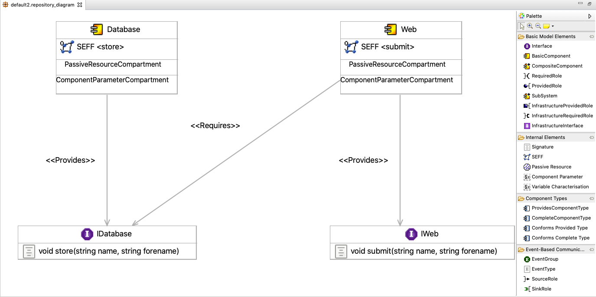
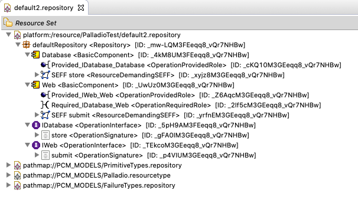

# Palladio-Addons-FluentApiModelGenerator
A fluid interface for easy and programmatic creation of PCM model instances.

If you are familiar with the background of PCM and fluent interfaces, jump directly to [Motivation](#motivation) or [How to use the Fluent API Model Generator](#how-to-use-the-fluent-api-model-generator).

## Background

### Palladio Component Model (PCM)
Palladio is a software architecture simulation approach which analyses your software at the model level for performance bottlenecks, scalability issues, reliability threats, and allows for a subsequent optimization.
The Palladio Component Model (PCM) is one of the core assets of the Palladio approach. It is designed to enable early performance, reliability, maintainability, and cost predictions for software architectures and is aligned with a component-based software development process. The PCM is implemented using the Eclipse Modeling Framework (EMF). Visit the [Homepage](https://www.palladio-simulator.com) for more information.

#### Creation of PCM Models
The PCM is realized as an Eclipse Plugin. The creation of the different palladio models is fairly similar. As an example, the creation of a repository is shown. Creating PCM repository model is fairly simple using the diagram editor. The image below shows the graphical diagram editor with a simple repository model. The palette on the right provides the user with all the model elements. Selecting an element and clicking onto the model plane creates the basic model elements. Additionally, most elements can be further edited using the ```Properties``` view.

The tree view of the repository model editor shows the model elements in their structure. New model elements, i.e. children of the tree branches, can be created by right clicking on a tree node. The editor shows the selection that is sensible at this point in the model structure. Furthermore, the tree view shows the 3 repositories that are imported by default: primitive types, failure types and a resource repository. Their elements can be used freely.


#### Fluent Interfaces
A fluent interface, also called fluent API, is a certain style of interface which is especially useful for creating and manipulating objects. The goal of a fluent interface is to increase code legibility by creating a domain-specific language (DSL). Its design relies on method chaining to implement method cascading. Thus, each method usually returns this, i.e. the manipulated object itself. Furthermore, the chaining methods are supposed to "flow like a natural sentence" (hence the name "fluent interface"), automatically guiding the user and giving a natural feeling of the available features.

Prominent examples of fluent interfaces are the [Java Stream API](https://docs.oracle.com/javase/8/docs/api/java/util/stream/package-summary.html) and [JMock](http://jmock.org).

## Motivation
Even though the model editor provides a comfortable and graphic possibility of creating PCM models, experienced users may find it exhausting to work with a graphical interface and wish for a simple API to create their models programmatically and therefore faster.
However, the backend of PCM provides not just one but around 10 different factories, that are needed to create a PCM repository model and 5 needed for the system model. Although the allocation and resource environment model each only require a single factory to be created, a fluent api exists for their creation. This ensures that all models can be created in a similar fashion. Searching for the correct factory for the different model elements and the method names that sets the desired properties is not user friendly. Especially, because the model objects offer more method proposals than sensible for creating a repository model.

The following code example shows the code needed for creating half of the repository model from the image of the graphical editor.

```java
// Factory
RepositoryFactory repoFact = RepositoryFactory.eINSTANCE;

// Repository
Repository repository = repoFact.createRepository();

// Database component
BasicComponent databaseComponent = repoFact.createBasicComponent();
databaseComponent.setEntityName("Database");

// IDatabase interface
OperationInterface databaseInterface = repoFact.createOperationInterface();
databaseInterface.setEntityName("IDatabase");

// Signature store
OperationSignature store = repoFact.createOperationSignature();
store.setEntityName("store");
// with parameters forename, name
Parameter forename = repoFact.createParameter();
forename.setParameterName("forename");
forename.setDataType__Parameter(null); // referencing the imported data types poses another problem
Parameter name = repoFact.createParameter();
name.setParameterName("forename");
name.setDataType__Parameter(null);

// Seff for Database component on service store
ResourceDemandingSEFF storeSeff = SeffFactory.eINSTANCE.createResourceDemandingSEFF();
storeSeff.setDescribedService__SEFF(store);
databaseComponent.getServiceEffectSpecifications__BasicComponent().add(storeSeff);

// Providing connection from Database component to IDatabase interface
OperationProvidedRole dbProvIDb = repoFact.createOperationProvidedRole();
dbProvIDb.setProvidedInterface__OperationProvidedRole(databaseInterface);
dbProvIDb.setProvidingEntity_ProvidedRole(databaseComponent);

// Adding component + interfaces to the repository
repository.getComponents__Repository().add(databaseComponent);
repository.getInterfaces__Repository().add(databaseInterface);
```

The overhead of creating the repository model that way is extensive. The fluent API has the goal not only to reduce the overhead of creating a model programmatically but also to provide a clear frame that guides the user through the different steps of the model creation, naturally indicating which step comes next. Consequently, the API is easy to use even for unexperienced users.

Check out the full code of the example from the image of the graphical editor [here](documentation/repository.md#example).

## How to use the Fluent API Model Generator

The easiest way to use the API as an end user is to install it in Eclipse via the provided update page:
* https://updatesite.palladio-simulator.com/palladio-addons-fluentapimodelgenerator/nightly/

### Project Setup

For using the fluent API, three dependencies are required:
1. Palladio-Core-PCM (org.palladiosimulator.pcm)
2. Palladio-Core-PCM Resources (org.palladiosimulator.pcm.resources)
3. Palladio FluentAPI (org.palladiosimulator.fluentapi)

It is recommended to work with a PCM installation. Therefore, install the PCM Nightly as described at [PCM_Installation#PCM_Nightly](https://sdqweb.ipd.kit.edu/wiki/PCM_Installation#PCM_Nightly).
Create your own Plug-in Project and add the three dependencies in the MANIFEST.MF file.
You are now ready to use the fluent API to create Models.

### Create Models
The different models each have their own factory. See the links below to get an introduction to each of the models.
- [Repository](documentation/repository.md)
- [System](documentation/system.md)
- [Resource Environment](documentation/resourceEnvironment.md)
- [Allocation](documentation/allocation.md)
- [Usage Model] (documentation/usagemodel.md)

## Validation
Upon creation, all models are validated. If they are not valid, all errors are logged to the console. The validation is the same as with the graphical and tree editors.
The creation of the usage model is designed to prevent validation errors during creatiog with using mandatory parameters.

## Save and Load Models
The fluent API provides the utility classes ```ModelSaver``` and ```ModelLoader```. These can be used to save or load all of the supported models.

## Testing
For the usage model JUnit testing is available. The tests and a bigger example can be found in [```FluentUsageModelFactoryTest```](tests/org.palladiosimulator.generator.fluent.test/src/org/palladiosimulator/generator/fluent/usagemodel/factory).

## Miscellaneous
See the Palladio-Jira for further improvements to this API:
* https://jira.palladio-simulator.com/browse/COMMONS-30
