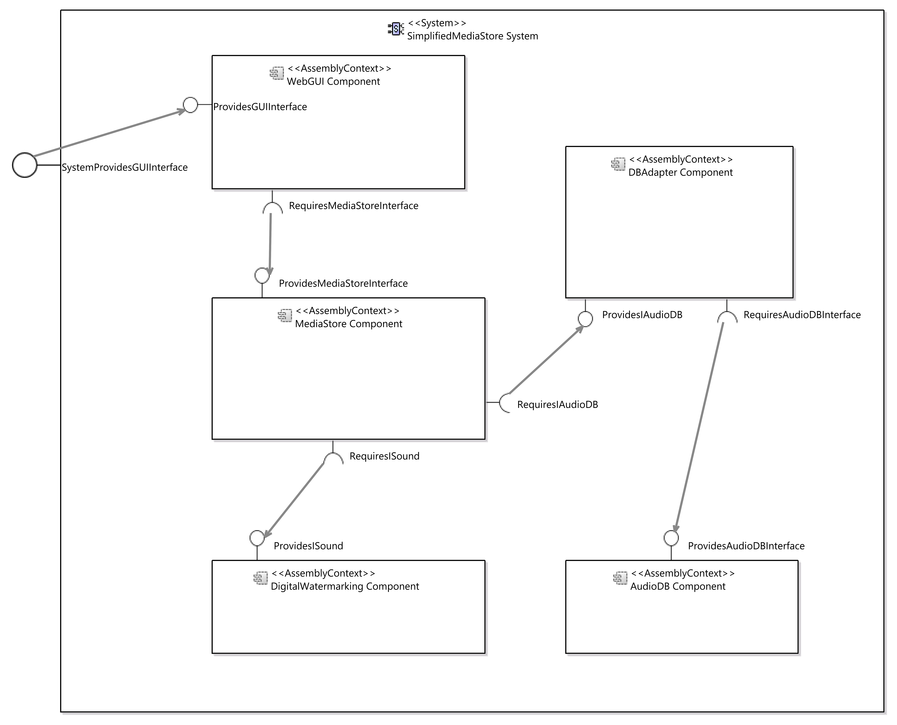

# System Model
## Structure of the API
The fluent API's main component to create system models is the ```FluentSystemFactory```. This factory can create
- a system
- assembly contexts
- event channels
- provided and required roles of the system
- connectors
- qos annotations

## Getting Started
Creating a PCM system model via the Palladio Fluent API always starts with the same three lines of code:
```java
FluentSystemFactory create = new FluentSystemFactory();
System system = create.newSystem()
    //add entities to the system
	.createSystemNow();
```
This creates and empty system. However, this is not a valid system, as each system has to provide at least one role. The next step is to add a repository to the system:
```java
System system = create.newSystem()
    .addRepository(ModelLoader.loadRepository("*.repository file"))
```
While this step is not necessary, it eases the creation of a system. The entities of repositories added to the system like this can be referenced with their name when creating system entities. Otherwise pointers to them would be required.

All system entities are added to the system with the method ```addToSystem```. And created with the ```FluentSystemFactory```. An assembly context for example would be created like this:
```java
System system = create.newSystem()
    ...
    .addToSystem(create.newAssemblyContext()
        .withName("assembly context")
        .withEncapsulatedComponent("repository component"))
```

## Assembly Contexts
Assembly contexts are the representation of repository components in the system model. If the repository was added to the system as described above, the component encapsulated in the assembly context can be referenced by its name.

## Event Channels
Event Channels can be used to pass events between multiple assembly contexts. They are bound to one event group, specified in the repository.
```java
create.newEventChannelCreator()
    .withName("event channel")
    .withEventGroup("event group")
```

## Provided and Required Roles
Just like the components in the repository, systems can provide or require roles. The roles are bound to one interface. The possible roles are:
- OperationProvidedRole
- OperationRequiredRole
- InfrastructureProvidedRole
- InfrastructureRequiredRole
- SinkRole
- SourceRole
- ResourceRequiredRole

An OperationProvidedRole for example would be created like this:
```java
create.newOperationRequiredRole()
    .withName("system required role")
    .withRequiredInterface("interface")
```
The roles can be delegated to the role of an assembly context with a delegation connector.

## Connectors
The connectors can be divided into assembly connectors and delegation connectors. In addition, for event groups, event channel connectors exist, connecting an assembly context to an event channel.

### Assembly Connectors
Assembly connectors connect the provided and required roles of two assembly connectors. These types of assembly connectors exist:
- AssemblyConnector
- AssemblyInfrastructureConnector
- AssemblyEventConnector

An AssemblyConnector for example connects an OperationRequiredRole with an OperationProvidedRole and is created like this:
```java
create.newAssemblyConnector()
    .withName("connector")
    .withRequiringAssemblyContext("context 1")
    .withOperationRequiredRole("required interface")
    .withProvidingAssemblyContext("context 2")
    .withOperationProvidedRole("provided interface")
```

### Delegation Connectors
Delegation connectors connect a role of the system with a role of the same type of an assembly connector. These types of delegation connector exist:
- ProvidedDelegationConnector
- RequiredDelegationConnector
- ProvidedInfrastructureDelegationConnector
- RequiredInfrastructureDelegationConnector
- SourceDelegationConnector
- SinkDelegationConnector
- RequiredResourceDelegationConnector
- ResourceRequiredDelegationConnector

A ProvidedInfrastructureDelegationConnector for example is created like this:
```java
create.newProvidedInfrastructureDelegationConnector()
    .withName("delegation connector")
    .withOuterProvidedRole("infrastructure provided role")
    .withProvidingContext("context")
    .withInfrastructureProvidedRole("provided infrastructure")
```

### Event Channel Connectors
Event channel connectors connect a source or a sink role of an assembly connector with an event channel. These types of event channel connectors exist:
- EventChannelSinkConnector
- EventChannelSourceConnector

An EventChannelSinkConnector for example is created like this:
```java
create.newEventChannelSinkConnector()
    .withName("sink connector")
    .withEventChannel("event channel")
    .withAssemblyContext("context")
    .withSinkRole("handles event")
```

## QoS Annotations
QoS annotation entities can be created and added to the system. Also SpecifiedQoSAnnotation as well as SpecifiedOutputParameterAbstraction can be added to the QoS entity. However, the creation of the annotations itself is not currently supported. The QoSAnnotations entity is created like this:
```java
create.newQoSAnnotations()
    .withName("annotations")
    .addQoSAnnotation(/*created in some other way*/)
    .addOutputParameterAbstraction(/*created in some other way*/)
```

## Example
A simplified version of the media store example with five components and connections between them can be created like this:
```java
FluentSystemFactory create = new FluentSystemFactory();
System system = create.newSystem()
    .withName("SimplifiedMediaStore System")
    .withRepository(ModelLoader.loadRepository("./simplifiedMediaStore.repository"))
    //create assembly contexts
    .addToSystem(create.newAssemblyContext()
        .withName("AudioDB Component")
        .withEncapsulatedComponent("AudioDB"))
    .addToSystem(create.newAssemblyContext()
        .withName("DBAdapter Component")
        .withEncapsulatedComponent("DBAdapter"))
    .addToSystem(create.newAssemblyContext()
        .withName("DigitalWatermarking Component")
        .withEncapsulatedComponent("DigitalWatermarking"))
    .addToSystem(create.newAssemblyContext()
        .withName("MediaStore Component")
        .withEncapsulatedComponent("MediaStore"))
    .addToSystem(create.newAssemblyContext()
        .withName("WebGUI Component")
        .withEncapsulatedComponent("WebGUI"))
    //create assembly connectors
    .addToSystem(create.newAssemblyConnector()
        .withName("AudioDBInterfaceConnector")
        .withProvidingAssemblyContext("AudioDB Component")
        .withOperationProvidedRole("ProvidesAudioDBInterface")
        .withRequiringAssemblyContext("DBAdapter Component")
        .withOperationRequiredRole("RequiresAudioDBInterface"))
    .addToSystem(create.newAssemblyConnector()
        .withName("IAudioDB Connector")
        .withProvidingAssemblyContext("DBAdapter Component")
        .withOperationProvidedRole("ProvidesIAudioDB")
        .withRequiringAssemblyContext("MediaStore Component")
        .withOperationRequiredRole("RequiresIAudioDB"))
    .addToSystem(create.newAssemblyConnector()
        .withName("ISound Connector")
        .withProvidingAssemblyContext("DigitalWatermarking Component")
        .withOperationProvidedRole("ProvidesISound")
        .withRequiringAssemblyContext("MediaStore Component")
        .withOperationRequiredRole("RequiresISound"))
    .addToSystem(create.newAssemblyConnector()
        .withName("MediaStoreInterface Connector")
        .withProvidingAssemblyContext("MediaStore Component")
        .withOperationProvidedRole("ProvidesMediaStoreInterface")
        .withRequiringAssemblyContext("WebGUI Component")
        .withOperationRequiredRole("RequiresMediaStoreInterface"))
    //add a provided role to the system and delegate it to the WebGUI component
    .addToSystem(create.newOperationProvidedRole()
        .withName("SystemProvidesGUIInterface")
        .withProvidedInterface("GUIInterface"))
    .addToSystem(create.newProvidedDelegationConnectorCreator()
        .withName("GUIInterface Connector")
        .withOuterProvidedRole("SystemProvidesGUIInterface")
        .withProvidingContext("WebGUI Component")
        .withOperationProvidedRole("ProvidesGUIInterface"))
    .createSystemNow();
```

The created system looks like this: 

The package [```system.examples```](../bundles/org.palladiosimulator.generator.fluent/src/org/palladiosimulator/generator/fluent/system/examples/) provides more examples of systems that were created using the fluent API.