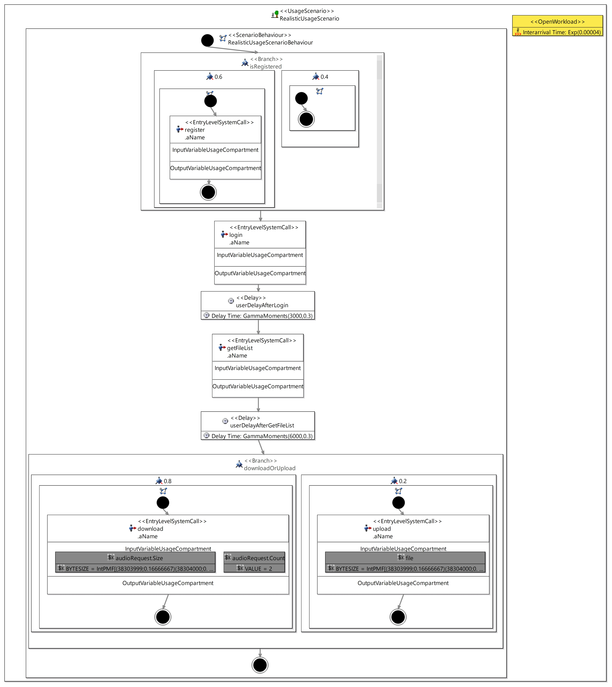

# Usage Model
## Structure of the API 
The fluent API's main component to create resource environments is the ```FluentUsageModelFactory```. This factory can create
* a usage model
* usage scenario with
    * scenario behaviour with actions
	* workload
* user data with
	* assembly context
	
All the model elements get added and created by method chaining. For the objects out of the a System Model the factory allows the user to reference them over fetching methods. With required parameter values it gets assured that the final usage model is valid.

## Getting Started 
Creating a PCM usage model via the Palladio Fluent API always starts with the same three lines of code:
```java
FluentUsageModelFactory create = new FluentUsageModelFactory();
UsageModel usageModel = create.newUsageModel()
    //add entities to the resource environment
    .createUsageModelNow();
```
This creates an empty usage model. The next step would be to add an usage scenario and/or specifiy user data with the method ```addToUsageModel```.
If one or more predefined systems are needed later, they get added first. 
```java
FluentUsageModelFactory create = new FluentUsageModelFactory();
UsageModel usageModel = create.addSystem(System)
    .newUsageModel()   
    .createUsageModelNow()
```

## Usage Scenario 
Usage scenarios describes the services invoked by the users and a calling sequence. It can have a name, but it is required to define a scenario behaviour and workload. 

```java
create.newUsageScenario(ScenarioBehaviour, Workload)
	.withName("Name")
```

### Workload
There are two types of a workload. 
The closed workload specifies directly the (not mandatory) user population and a think time.
```java
create.newClosedWorkload("ThinkTime")
	.withPopulation(10)
```
The Open Workload specifies usage intensity with an inter-arrival time between two arrivals at the system.
```java
create.newOpenWorkload("ArrivalTime")
```

### Scenario Behaviour
A scenario behvaiour defines the possible actions and their sequence. It can have a name and different actions. A chain of actions need to Start with a start action and end with an stop action. If not defined manually, they get added automatically during object creation.
```java
create.newScenarioBehavior()
	.withName("Name")
	.addToScenarioBehaviour(Action)
```

Possible actions are start, branch, delay, entry level system call, loop and stop.
For each of the actions (beside stop) there needs to be a successor action defined, also each action can have a name.
```java
create.newStartAction()
	.withName("Name")
	.withSuccessor(Action)
```
Some actions have special paramaters. The branch action can have different branch transitions, each with their own probability. All the probabilities need to sum up to 1.
The delay action has a time specification of the timing delay needed between two actions.
For the loop a behaviour and the number of itearations need to be set.
An entry level system call is more complex. For that a reference to objects out of the system is need. They be fetched with the method defined in line 2 below. For that the name of the system and the name of the provided role and the connected opeation signature are needed. Additonal for the entry level system call action there can be given a name, priority and some input and output variables.

```java
create.newEntryLevelSystemCall(
    create.fetchOffOperationRoleAndSignature("System Name","ProvidedRoleName", "OperationSignatureName"))
    .withName("Name")
    .addToEntryLevelSystemCallInput(create.newVariableUsage("InputVariable"))
    .addToEntryLevelSystemCallOutput(create.newVariableUsage("OutputVariable"))
    .withPriority(1)
```
  
## User Data 
The user data defines data used in an assembly context from the system.
Variable Usages can be added if wanted.
```java
create.newUserData(create.fetchOffAssemblyContextByName("System Name", "Context Name"))
	.addToUserData(VariableUsage)
```		

## Example
An example of the usage model of a realistic media store example can be created like this with a mock of the needed System called system.

```java
FluentUsageModelFactory create = new FluentUsageModelFactory();
UsageModel usgModel = this.create.addSystem(system).newUsageModel().addToUsageModel(
    this.create.newUsageScenario(
        this.create.newScenarioBehavior().withName("RealisticUsageScenarioBehaviour")
        .addToScenarioBehaviour(
                this.create.newStartAction().withName("startUsage").withSuccessor(
                this.create.newBranchAction().withName("isRegistered")
                    .addToBranchAction(this.create.newBranchTransition(this.create.newScenarioBehavior().addToScenarioBehaviour(
                            this.create.newEntryLevelSystemCall(
								this.create.fetchOffOperationRoleAndSignature("defaultSystem","Provided_IWebGui", "register"))
								.withName("register"))
                            .withName("needsToRegister")).withProbability(0.6))
                    .addToBranchAction(this.create.newBranchTransition(this.create.newScenarioBehavior().withName("isAlreadyRegistered")
                            ).withProbability(0.4)).withSuccessor(                                
                this.create.newEntryLevelSystemCall(
                        this.create.fetchOffOperationRoleAndSignature("defaultSystem","Provided_IWebGui","login"))
                        .withName("login").withSuccessor(
                this.create.newDelayAction("GammaMoments(3000,0.3)").withName("userDelayAfterLogin").withSuccessor(
                this.create.newEntryLevelSystemCall(
                        this.create.fetchOffOperationRoleAndSignature("defaultSystem","Provided_IWebGui","getFileList"))
                        .withName("getFileList").withSuccessor(
                this.create.newDelayAction("GammaMoments(6000,0.3)").withName("userDelayAfterGetFileList").withSuccessor(
                this.create.newBranchAction().withName("downloadOrUpload")
                    .addToBranchAction(this.create.newBranchTransition(this.create.newScenarioBehavior().withName("downloadCase")
                            .addToScenarioBehaviour(this.create.newEntryLevelSystemCall(
                                    this.create.fetchOffOperationRoleAndSignature("defaultSystem","Provided_IWebGui","download"))
                                    .withName("download")
                                    .addToEntryLevelSystemCallInput(
										this.create.newVariableUsage("audioRequest", "Size")
										.withVariableCharacterisation("IntPMF[(38303999;0.16666667)(38304000;0.16666667)(40568000;0.16666667)
										(41544000;0.16666667)(48280000;0.16666666)(65000000;0.16666667)(88216000;0.16666666)]",
										VariableCharacterisationType.BYTESIZE))
                                    .addToEntryLevelSystemCallInput(
										this.create.newVariableUsage("audioRequest", "Count")
										.withVariableCharacterisation("2", VariableCharacterisationType.VALUE))
                                    )).withProbability(0.8))
                    .addToBranchAction(this.create.newBranchTransition(this.create.newScenarioBehavior().withName("uploadCase")
                            .addToScenarioBehaviour(this.create.newEntryLevelSystemCall(
                                    this.create.fetchOffOperationRoleAndSignature("defaultSystem","Provided_IWebGui","upload"))
						.withName("upload")
						.addToEntryLevelSystemCallInput(
							this.create.newVariableUsage("file")
							.withVariableCharacterisation("IntPMF[(38303999;0.16666667)(38304000;0.16666667)(40568000;0.16666667)
							(41544000;0.16666667)(48280000;0.16666666)(65000000;0.16666667)(88216000;0.16666666)]",
							VariableCharacterisationType.BYTESIZE))
                        )).withProbability(0.2)).withSuccessor(
                this.create.newStopAction().withName("stopUsage"))))))))),        
        this.create.newOpenWorkload("Exp(0.00004)")).withName("RealisticUsageScenario"))               
    .createUsageModelNow();
```

The created usage model looks like this: 


More examples and testing can be found in the JUnit Test [```FluentUsageModelFactoryTest```](tests/org.palladiosimulator.generator.fluent.test/src/org/palladiosimulator/generator/fluent/usagemodel/factory/FluentUsageModelFactoryTest.java).